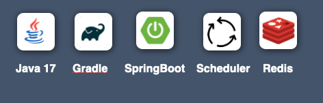

## 📖 누출 버킷 알고리즘 구현 API

---

- 대규모 트래픽 4장 **“처리율 제한 장치 설계”** 에 소개된 **누출 버킷 알고리즘**을 구현한 API입니다.

<br/>

## 🛠️ 사용 SW

---



<br/>

## 🏢 아키텍처 구조

---


```
├── common 패키지
│    └── config 패키지
│          └── RedisConfig.class
│
│    └── dto 패키지
│          └── ExceptionResponse.class
│    └── exception 패키지
│          └── BusinessException.class
│          └── CommonException.class
│          └── CommonExceptionCode.enum
│          └── ExceptionCode.interface
│          └── GlobalExceptionHandler.class
│
├── Controller 패키지
│    └── LeakyBucketCounterController.class
│
├── dto 패키지
│    └── response 패키지
│          └── LeakyBucketResponse.class
│          └── LeakyBucketProfileResponse.class
│
├── exception 패키지
│    └── RateException.class
│    └── RateLimitExceededException.enum
│
├── service 패키지
│     └── LeakyBucketService.class
│ 
└──  LeakyBucketApplication.class

```

<br/>

## ✏️ API 설명

---

### 1️⃣ 누출 버킷 생성 API
- 누출 버킷 생성 API는 누출 버킷 알고리즘을 구현한 API입니다.
- 이 API를 호출하면 Redis에 토큰 버킷을 생성하고, 초기 토큰 수를 최대 허용 수(1000개)로 설정합니다.
- 토큰이 남아있는 경우, 요청을 받고 토큰 수를 하나 감소시킵니다.
- 토큰이 없을 경우, 즉 최대 요청 허용 수를 초과한 경우에는 요청이 제한됩니다.
- 요청이 성공적으로 처리되면, 현재 토큰 버킷의 키와 생성된 토큰 수를 반환합니다.

``` Http
POST /leaky-bucket
```

### ⏱ 누출 버킷 리필 스케줄러
- 해당 코드는 토큰 버킷 리필 로직을 주기적으로 실행하는 스케줄러를 포함하고 있습니다.
- 스케줄러는 매 60초마다 토큰 버킷을 검사하여, 토큰 버킷의 토큰 수를 최대 허용 수(1000개)까지 리필합니다.
- 1분마다 최대 5개의 토큰을 소비하여 토큰 수를 조정합니다.

<br/>

### 2️⃣ 누출 버킷 조회 API
- 생성된 토큰 버킷의 정보를 조회하는 API입니다.
- Redis에서 토큰 버킷을 스캔하여, 각 버킷의 현재 토큰 수와 함께 반환합니다.
- 모든 유효한 토큰 버킷의 키와 해당 키의 생성된 토큰 수를 조회할 수 있습니다.

``` Http
GET /leaky-bucket
```
